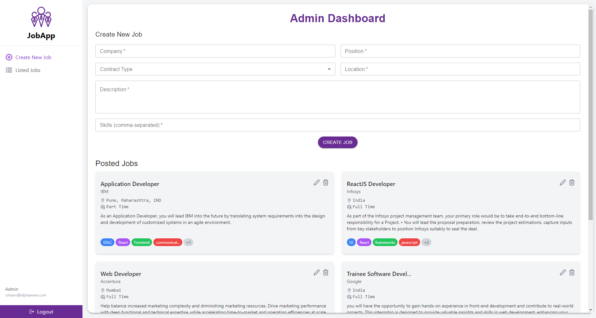
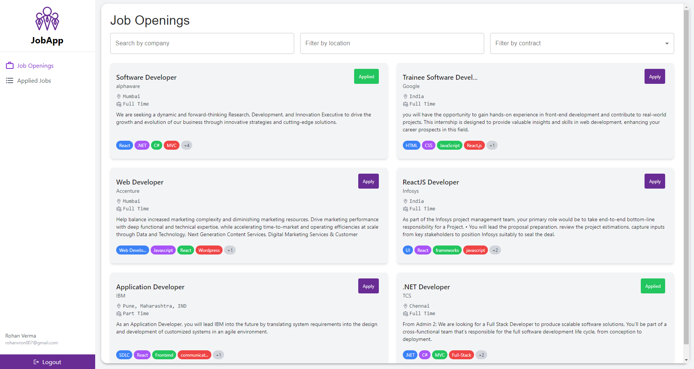

# JobApp - Job Application Management System

JobApp is a comprehensive job application management system designed to streamline the process of job posting and application for both employers and job seekers.

## Features

### Admin Features

Administrators have the following capabilities:

- Post new job listings
- Edit existing job postings
- Update job details
- Delete job listings
- Can View all jobs posted by admin

<p align="center">
  
</p>

### User Features

Job seekers can:

- View all job listings posted by admins
- Apply to job openings
- View their applied jobs in a dedicated section
- Filter jobs by company name, location, and contract type

<p align="center">
  
</p>

## Technologies Used

### Frontend
- React.js
- Redux for state management
- Material-UI for UI components
- Axios for API requests

### Backend
- Node.js
- Express.js
- MongoDB for database
- Mongoose for object modeling
- JSON Web Tokens (JWT) for authentication

## Setup

1. Clone the repository:
```git clone https://github.com/rohanvron/JobApp```
```cd JobApp```

2. Install dependencies:
```cd frontend && npm install cd ../backend && npm install```


3. Set up the MongoDB server:
- Start your MongoDB server
- Create a database named `jobApp`
- The collection will be `users` & `jobs` 

4. Set up environment variables:
Create a `.env` file in the `backend` directory with the following content:
`MONGODB_URI=mongodb: your connection string `
`PORT=5000`
`JWT_SECRET=jwt_secret`


## Running the Application

1. Start the backend server:
```cd backend npm run dev```


2. In a new terminal, start the frontend development server:
```cd frontend npm run dev```


3. Open your browser and navigate to `http://localhost:5173/JobApp` to view the application.

## Deployment

- Frontend: GitHub Pages
- Backend: Vercel

## API Endpoints

- POST /api/auth/signup - User registration
- POST /api/auth/login - User login
- GET /api/jobs - Fetch all jobs
- POST /api/jobs - Create a new job (Admin only)
- PUT /api/jobs/:id - Update a job (Admin only)
- DELETE /api/jobs/:id - Delete a job (Admin only)
- POST /api/jobs/:id/apply - Apply for a job (User only)
